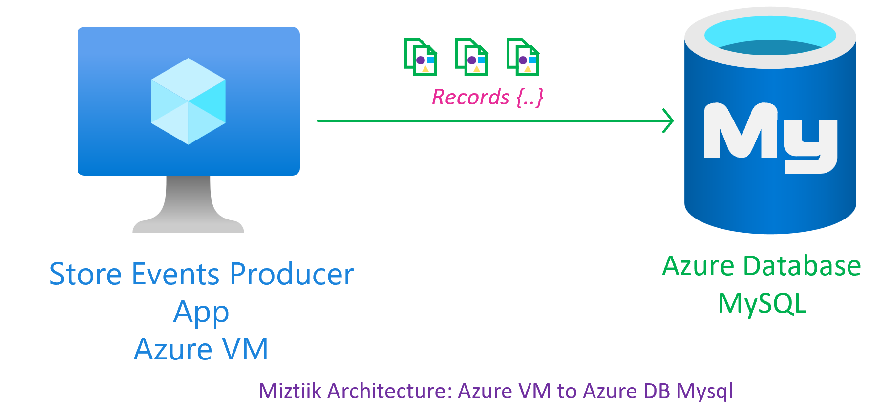

# Azure Virtual Machine to Azure Database for MySQL - Secure Connection

A simple demo to connect to Azure DB for Mysql from Azure VM running Ubuntu.

## 🎯 Solution



1. ## 🧰 Prerequisites

   This demo, along with its instructions, scripts, and Bicep template, has been specifically designed to be executed in the `northeurope` region. However, with minimal modifications, you can also try running it in other regions of your choice (the specific steps for doing so are not covered in this context)

   - 🛠 Azure CLI Installed & Configured - [Get help here](https://learn.microsoft.com/en-us/cli/azure/install-azure-cli)
   - 🛠 Azure Function Core Tools - [Get help here](https://learn.microsoft.com/en-us/azure/azure-functions/functions-run-local?tabs=v4%2Cwindows%2Ccsharp%2Cportal%2Cbash#install-the-azure-functions-core-tools)
   - 🛠 Bicep Installed & Configured - [Get help here](https://learn.microsoft.com/en-us/azure/azure-resource-manager/bicep/install)
     - 🛠 [Optional] VS Code & Bicep Extenstions - [Get help here](https://learn.microsoft.com/en-us/azure/azure-resource-manager/bicep/install#vs-code-and-bicep-extension)
   - `jq` - [Get help here](https://stedolan.github.io/jq/download/)
   - `bash` or git bash - [Get help here](https://git-scm.com/downloads)

2. ## ⚙️ Setting up the environment

   - Get the application code

     ```bash
     git clone https://github.com/miztiik/azure-web-server-to-mysql.git
     cd azure-web-server-to-mysql
     ```

3. ## 🚀 Prepare the local environment

   Ensure you have jq, Azure Cli and bicep working

   ```bash
   jq --version
   func --version
   bicep --version
   bash --version
   az account show
   ```

4. ## 🚀 Deploying the Solution

   - **Stack: Main Bicep**
     The params required for the modules are in `params.json`. Modify them as needed. The helper deployment script `deploy.sh` will deploy the `main.bicep` file. This will create the following resoureces
     - Resource Group(RG)
     - VNet, Subnet & Virtual Machine
     - Virtual Machine(Ubuntu) - `2` - Defined in `params.json` named `vmCount`
        - Bootstrapped with custom libs using `userData` script - Installs Nginx
        - Install Azure Monitoring Agent
     - User Managed Identity - Identity attached to the VM with the following permissions,
        - Monitoring Metrics Publisher
     - Azure Database for MySQL Server - Single Server
        - Firewall Rule - Allow Azure Services
        - Firewall Rule - Allow VM Subnet
        - Firewall Rule - Allow Public IP
        - Firewall Rule - Allow Local Machine
        - Admin User
        - Admin Password
        - SQL Version  - `8.0`

     **Note** - I hacked the template from another repo of mine, so you will see some unused resources(log analytics workspace/queues etc.,). _You can safely ignore them, But do remember to clean up your Resource Group to avoid unnecessary costs._

    ```bash
    # make deploy
    sh deployment_scripts/deploy.sh
    ```

     After successfully deploying the stack, Check the `Resource Groups/Deployments` section for the resources.

5. ## 🔬 Testing the solution

   - Login to your VM, You can find the public IP address in the resource blade. You can also get it from the Azure Portal. _You may also try connecting to the database from local machine if you have mysql client, In this case, lets use the Azure VM as it is already bootstrapped with the mysql client_

     ```bash
     ssh miztiik@<PUBLIC_IP_ADDRESS>
     ```

   - You can find the Database Server anem balancer public IP address in the resource blade. You can also get it from the Azure Portal.

      ```bash
      #!/bin/bash

      # MySQL Server Details
      HOST='store-backend-web-server-to-mysql-db-002.mysql.database.azure.com'
      PORT=3306
      USERNAME='miztiik@store-backend-web-server-to-mysql-db-002'
      PASSWORD=''

      # Database and Table Details
      DATABASE="miztiik_store_backend_db_2"
      TABLE="store_events_2"


      # Maximum record count for the for loop
      RECORD_COUNT=10

      # Connect to MySQL and create database
      mysql -h "$HOST" -P "$PORT" -u "$USERNAME" -p"$PASSWORD" <<EOF
      CREATE DATABASE $DATABASE;
      EOF

      # Switch to the newly created database
      mysql -h "$HOST" -P "$PORT" -u "$USERNAME" -p"$PASSWORD" -e "USE $DATABASE;"

      # Create table
      mysql -h "$HOST" -P "$PORT" -u "$USERNAME" -p"$PASSWORD" -e "CREATE TABLE IF NOT EXISTS $DATABASE.$TABLE (id INT PRIMARY KEY, ts TIMESTAMP, msg VARCHAR(255));"

      # Insert records using for loop
      for ((i=1; i<=RECORD_COUNT; i++))
      do
      RANDOM_INCREMENT=$((RANDOM % 10 + 1))
      MESSAGE="Hello World from Miztiiik $RANDOM_INCREMENT"
      mysql -h "$HOST" -P "$PORT" -u "$USERNAME" -p"$PASSWORD" -e "INSERT INTO $DATABASE.$TABLE (id, ts, msg) VALUES ($i, CURRENT_TIMESTAMP, '$MESSAGE');"
      done

      # Verify inserted records
      mysql -h "$HOST" -P "$PORT" -u "$USERNAME" -p"$PASSWORD" -e "SELECT * FROM $DATABASE.$TABLE;"
      ```

      You should see an output like this,

      ```text
      +----+---------------------+------------------------------+
      | id | ts                  | msg                          |
      +----+---------------------+------------------------------+
      |  1 | 2023-05-27 18:42:13 | Hello World from Miztiiik 9  |
      |  2 | 2023-05-27 18:42:13 | Hello World from Miztiiik 5  |
      |  3 | 2023-05-27 18:42:13 | Hello World from Miztiiik 6  |
      |  4 | 2023-05-27 18:42:13 | Hello World from Miztiiik 10 |
      |  5 | 2023-05-27 18:42:13 | Hello World from Miztiiik 4  |
      |  6 | 2023-05-27 18:42:13 | Hello World from Miztiiik 3  |
      |  7 | 2023-05-27 18:42:13 | Hello World from Miztiiik 2  |
      |  8 | 2023-05-27 18:42:13 | Hello World from Miztiiik 8  |
      |  9 | 2023-05-27 18:42:13 | Hello World from Miztiiik 10 |
      | 10 | 2023-05-27 18:42:13 | Hello World from Miztiiik 8  |
      +----+---------------------+------------------------------+
      ```

6. ## 📒 Conclusion

   In this demonstration, we have shown how to connect to Azure DB for Mysql from Azure VM, insert and retreive records.
  
7. ## 🧹 CleanUp

   If you want to destroy all the resources created by the stack, Execute the below command to delete the stack, or _you can delete the stack from console as well_

   - Resources created during [Deploying The Solution](#-deploying-the-solution)
   - _Any other custom resources, you have created for this demo_

   ```bash
   # Delete from resource group
   az group delete --name Miztiik_Enterprises_xxx --yes
   # Follow any on-screen prompt
   ```

   This is not an exhaustive list, please carry out other necessary steps as maybe applicable to your needs.

## 📌 Who is using this

This repository aims to show how to Bicep to new developers, Solution Architects & Ops Engineers in Azure.

### 💡 Help/Suggestions or 🐛 Bugs

Thank you for your interest in contributing to our project. Whether it is a bug report, new feature, correction, or additional documentation or solutions, we greatly value feedback and contributions from our community. [Start here](/issues)

### 👋 Buy me a coffee

[](https://ko-fi.com/Q5Q41QDGK) Buy me a [coffee ☕][900].

### 📚 References

1. [Azure Docs: Just In Time Access][10]

### 🏷️ Metadata


**Level**: 100

[10]: https://learn.microsoft.com/en-us/azure/defender-for-cloud/just-in-time-access-usage

[100]: https://www.udemy.com/course/aws-cloud-security/?referralCode=B7F1B6C78B45ADAF77A9
[101]: https://www.udemy.com/course/aws-cloud-security-proactive-way/?referralCode=71DC542AD4481309A441
[102]: https://www.udemy.com/course/aws-cloud-development-kit-from-beginner-to-professional/?referralCode=E15D7FB64E417C547579
[103]: https://www.udemy.com/course/aws-cloudformation-basics?referralCode=93AD3B1530BC871093D6
[899]: https://www.udemy.com/user/n-kumar/
[900]: https://ko-fi.com/miztiik
[901]: https://ko-fi.com/Q5Q41QDGK